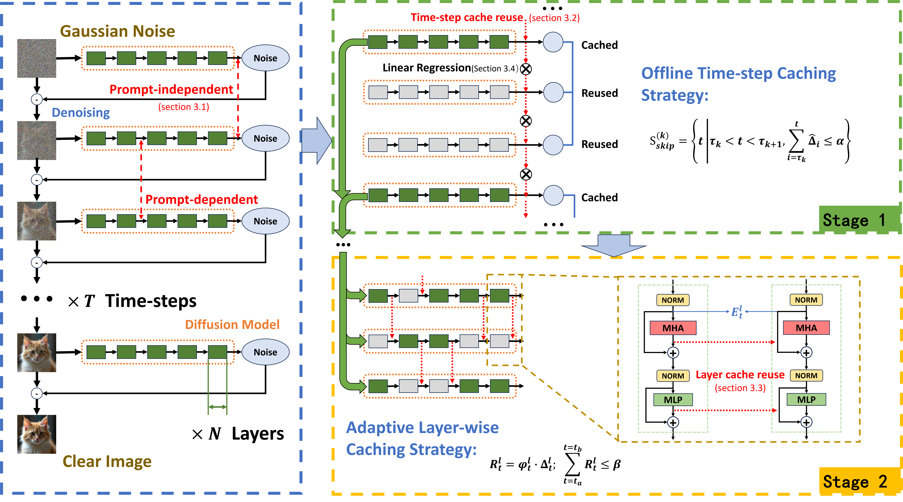

# MG-Cache: Multi-Granularity Caching for Accelerating Diffusion Transformer Inference

MG-Cache is a novel and fully training-free acceleration framework for Diffusion Transformer (DiT) inference. While DiTs have become a powerful backbone for high-quality image and video generation, their inference cost is dominated by the iterative denoising process and the quadratic growth of 3D self-attention, which makes high-resolution generation prohibitively expensive. Diffusion caching has emerged as a promising remedy, yet existing strategies fail to accurately identify the varying importance of different computational modules and rarely coordinate cache reuse across the timestep and layer granularities, making error accumulation difficult to control. To address these limitations, MG-Cache exploits computational redundancy at both granularities with a two-stage caching strategy: an offline timestep profiling analysis that identifies redundant timesteps whose computations can be safely skipped, followed by an adaptive layer-wise caching scheme that combines input stability with the importance of each Transformer layer to selectively cache stable Attention and MLP submodules. A lightweight linear regression compensation mechanism is further introduced to mitigate the distribution shift caused by cache reuse. Extensive experiments on mainstream open-source DiT models, such as HunyuanVideo and FLUX, validate the effectiveness of our approach, achieving significant acceleration while maintaining high fidelity to the uncached output, with up to a 4.18x speedup on HunyuanVideo.

**Paper:** [MG-Cache: Multi-Granularity Caching for Accelerating Diffusion Transformer Inference (Pacific Graphics 2026)](https://diglib.eg.org/items/fd588bbf-0ac6-4910-b075-280853d41adb)



*Overview of MG-Cache: a two-stage, multi-granularity caching framework that synergistically combines offline timestep profiling with online adaptive layer-wise caching to accelerate Diffusion Transformer inference.*

## Citation

If you find our work useful, please consider citing it:

```bibtex
@inproceedings{10.2312:pg.20261030,
  booktitle = {Pacific Graphics 2026 - Conference Papers and Posters},
  editor    = {He, Ying and Thuerey, Nils and Liu, Lingjie},
  title     = {{MG-Cache: Multi-Granularity Caching for Accelerating Diffusion Transformer Inference}},
  author    = {Chen, Zesen and Xu, Youxuan and Li, Shigang},
  year      = {2026},
  publisher = {The Eurographics Association},
  ISBN      = {978-3-03868-327-8},
  DOI       = {10.2312/pg.20261030}
}
```
